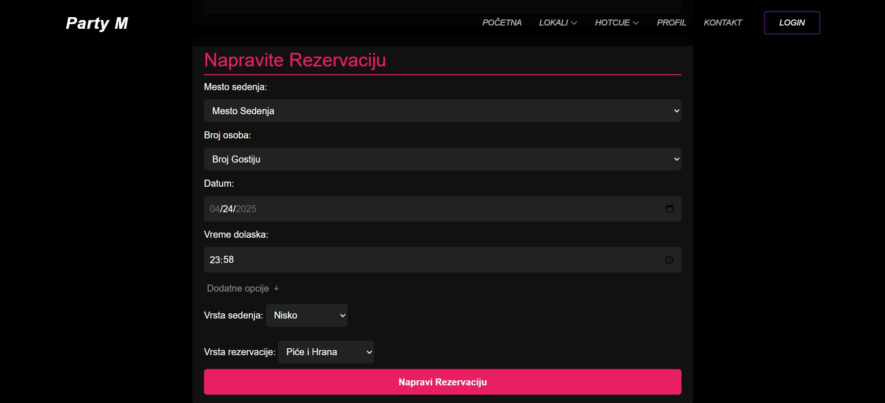

# PartyM - Web App for Restaurant Reservations

PartyM is a modern web application built for making reservations in restaurants across Novi Sad. The app eliminates the outdated phone-call method and allows users to book tables online in a few easy steps. It also has 3 different logins, everything tracked, and user friendly ui.

## 🌟 Features

- 📅 Browse available time slots for different restaurants
- ✅ Instant reservation confirmation
- 🔐 User login and profile management
- 💬 Admin dashboard for managing reservations
- 📊 Dynamic chart display (Chart.js) of daily reservations
- 🕒 Time-sensitive color coding for late or upcoming reservations
- 📥 Email notification system (Node.js)
- 🖼️ Profile photo upload feature

## 🔧 Technologies Used

- **Frontend**: HTML, CSS, Bootstrap, JavaScript
- **Backend**: PHP, MySQL
- **Email**: Node.js (nodemailer)
- **Charts**: Chart.js
- **Session Management**: PHP sessions
- **Hosting**: WAMP / XAMPP locally (dev) & GitHub for versioning

## 💡 How It Works

1. A user selects a restaurant and time slot.
2. The system checks availability and reserves the table.
3. Admin can approve or reject reservations.
4. Approved users receive an email confirmation.
5. Reservations are displayed dynamically with time-based insights.

## 📸 Screenshots

### Homepage

### Reservation

### Restaurant Manager page for upcoming reservations

### Reservation Manager page for upcoming approved reservation with chart.js

### Profile Page before restaurant approves the reservation

### After the reservation is approved by the restaurant, users can view the details on their profile page.  
They also have the option to notify the restaurant if they will be late, and after the visit,  
they can rate their reservation experience. 

### Email Confirmation

### PM2

